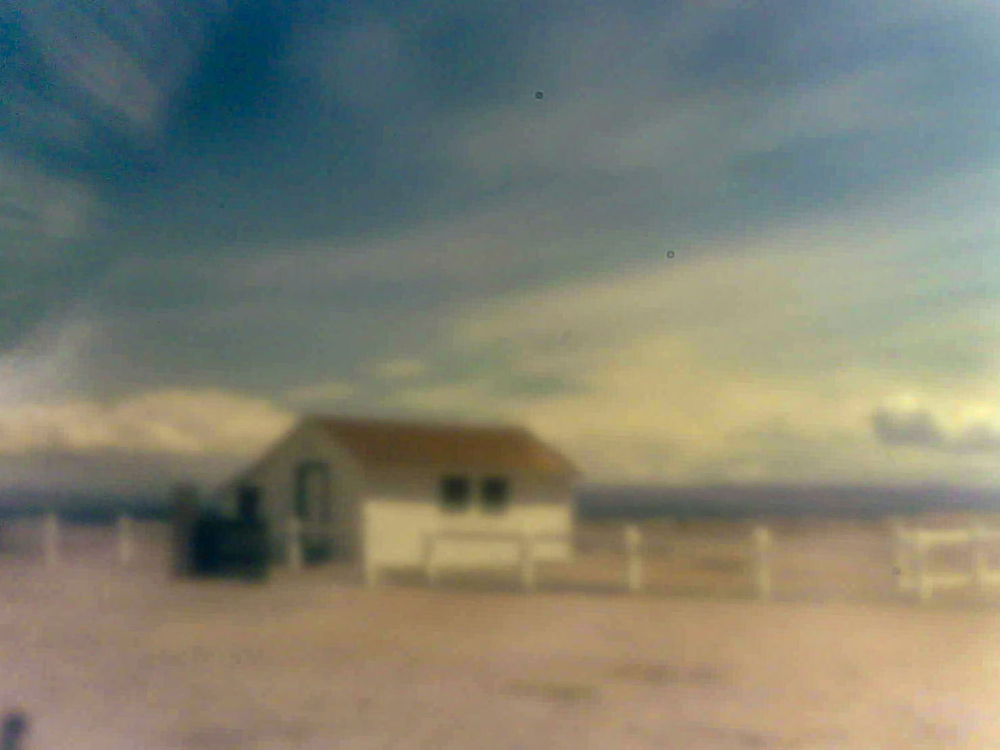

# ESP32 Pinhole Camera

## Overview

This repository contains Arduino framework-based firmware for a pinhole camera for the Thinker AI ESP32 CAM board. The idea is to use the ESP32 CAM board and camera as a "point and shoot" camera that saves the pictures it takes to an SD card inserted into the SD card slot built into the ESP32 CAM board. The firmware will work "out of the box" with the lens and camera unmodified. It's called a "pinhole camera" because the impetus for building it was to make a simple digital pinhole camera by substituting a pinhole for the camera lens. Just because.

The only controls are a switch that acts as the shutter release and the built-in reset button. To use the camera, power up the ESP32 and wait for the built-in red LED to flash five times. (There are two LEDS on the board. The red one is marked LED1 and is on the side of the board  with the processor. The other is the white "flash" LED on the camera side.) Once the red LED flashes, the camera is ready. If it repeatedly flashes, pauses and flashes again, count the number of flashes in a group to figure out what went wrong:

    Flashes  Problem
    =======  ====================================
          2  Camera initialization failed
          3  SD card file system mount failed
          4  No SD Card found in the card reader

To use the camera, click its shutter. The red LED will flash once to indicate that the image was captured and saved. If the red LED doesn't flash, something went wrong. Maybe I'll add more error indicator LED flashing if this turns out to be a problem, but so far it hasn't.

Activity on the SD card occurs at two only points. First, during initialization. And, second, after the shutter is pressed but before the red LED flashes to indicate the image was captured. So, it should be okay to pull the power on the camera at other times.

If the shutter isn't clicked for five minutes the camera will flash the red LED five times and go into deep sleep mode. To get it going again, press the reset button on the board.

## Camera Construction

The body of the camera is laser cut from 3mm Baltic birch plywood. Here are the parts:

The drawings are not kerf-compensated. The retaining ring is only needed for longer focal length pinholes.

The basic pinhole is made from thin kitchen aluminum foil stretched over one end of a 4mm length of thin-walled, 10.33mm o.d. brass tubing. (It's 3/8-inch i.d. stuff I had around the shop.) For the shortest focal length pinhole, the tube and foil are press-fit into the pinhole plate to form the pinhole assembly. For longer focal lengths, the pinhole assembly is formed by press fitting the tube and foil into the retaining ring and then press fitting the other end of the tube pinhole plate. The ESP CAM sensor, with its lens removed is placed in sensor plate to form the sensor assembly. The pinhole and sensor assemblies are stacked together and attached to the body of the camera with an M-3 screw that goes into a heat-stake nut pressed in from the back of the plywood camera body. The brass alignment pins in the camera body above and below the pinhole and sensor assemblies are made from 2.9mm diameter driver pins for pin-tumbler locks. The pinhole assembly is removable to allow pinhole assemblies with different focal lengths to be used. The shutter switch is a microswitch from my stock.

## The Pinhole

The ratio of the distance from the pinhole to the sensor (the "focal length") to the diameter of the pinhole (the "entrance pupil") is called the f-stop or focal ratio. For a pinhole camera to work at all well, the f-stop needs to be at least 32. Preferably higher. We can make the focal length whatever we want by moving the pinhole farther from the image sensor. A long focal length means the pinhole diameter can be bigger for the same f-stop, which makes it easier to make. But a long focal length also narrows the field of view that the camera sees. Here's a diagram showing a cross section of the pinhole and sensor assembly with different focal length pinholes:

Since the width of the sensor in the ESP-CAM is small (it's about 4mm across), the field of view quickly narrows as the focal length increases. I wanted a relatively wide field of view, which means a short focal length (I chose 4mm). That implies a pinhole diameter 0.125mm or smaller.

There's a process for manufacturing tiny, consistent-diameter pinholes in metal: Chemical etching. Just place a controlled-volume drop of the right concentration of etchant (ferric chloride, say) on a chemically clean, thin metal sheet (brass, say). Wait the right amount of time. Wash the etchant off, and you're done. Very repeatable. Once you figure out the values for all the variables. Which is fussy and time consuming.

Fortunately, there's a really easy way to make quite tiny pinholes, if you don't need a batch of them all the same size: Put a piece of thin kitchen aluminum foil on a plastic-topped desk. Poke it gently straight down from above with a sharp needle. Bob's your uncle. The plastic desktop is just soft enough to let the needle make a tiny hole. Using this method I can easily make nice, round holes of between 0.1 and 0.05mm in diameter. For a 4mm focal length, that's between f40 and f80.

## Results

Yes, it does work, and the results are very similar to traditional film-based pinhole cameras. Here's a photo of the boathouse at Point Wilson Light Station, Port Townsend, WA taken with the camera. The spots on the image are dust motes stuck to the sensor despite my efforts to remove them. Adds to the "character," I tell myself.

